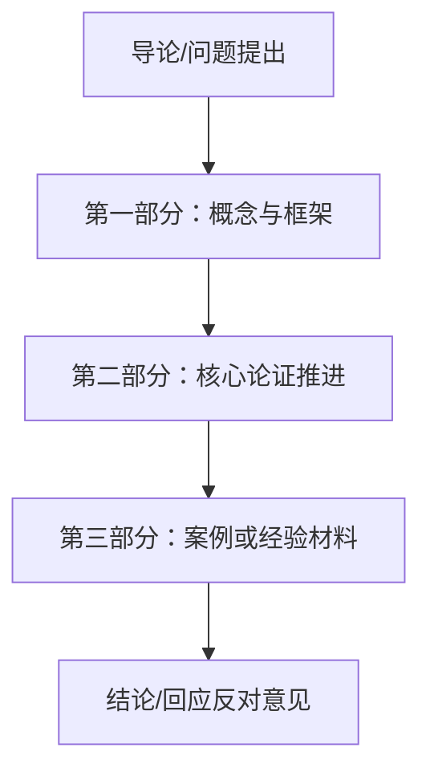

# 输出模板

## 单章精读模板

```md
# <章节标题>

## 本章在全书中的位置
<说明这一章在全书里承担什么作用，以及它与前后章节的连接>

## 本章要回答的核心问题
<写成真正的问题句，而不是主题名>

## 本章的核心主张
<用 1 到 3 段写出作者在本章最重要的判断>

## 论证链条拆解
<按步骤解释作者如何从前提走向结论。要保留关键转折、反驳、定义与推理动作>

## 关键概念与概念区分
### 概念 1：<术语>
- 定义：<定义>
- 本章作用：<它在这一章承担什么角色>
- 容易混淆：<与哪些概念不同>

### 概念 2：<术语>
- 定义：<定义>
- 本章作用：<角色>
- 容易混淆：<区别>

## 证据、案例与材料
<历史材料、数据、文献、案例、访谈、图注等如何支撑论证>

## 图像、图表与表格信息
<说明本章有哪些关键视觉材料，它们表达了什么，以及哪些细节应保留>

## 前提、限制与例外
<作者默认了什么，结论适用于哪里，不适用于哪里>

## 容易被忽略的细节
<普通摘要最容易丢掉、但会影响理解的细节>

## 一分钟回看
<一小段一眼回顾本章主线与关键细节>
```

## 全书结构图模板

```md
# 全书结构图

## 全书核心问题
<一段>

## 全书主论题
<一段>

## 逐章功能图
1. **第 1 章** — <功能>
2. **第 2 章** — <功能>

## 论证推进路径
<说明全书如何一步步推进>

## 章节关系图（Mermaid）


## 章节类型标记
- 奠基章：<哪些章>
- 推进章：<哪些章>
- 案例章：<哪些章>
- 收束章：<哪些章>
```

## 复习问题模板

```md
# 复习问题

## 基础理解
1. <问题>
2. <问题>

## 论证追踪
1. <问题>
2. <问题>

## 概念辨析
1. <问题>
2. <问题>

## 批判思考
1. <问题>
2. <问题>

## 迁移应用
1. <问题>
2. <问题>

## 记忆锚点
- <锚点 1>
- <锚点 2>

## 二刷路径图（Mermaid）

```

## CLI 索引文件模板

```json
{
  "book_structure": {
    "title": "<书名>",
    "source_type": "pdf|epub",
    "book_type": "<书型>",
    "structure_confidence": "high|medium|low",
    "chapters": [
      {
        "chapter_id": "ch01",
        "title": "<章节标题>",
        "order": 1,
        "start_locator": "<页码或epub定位>",
        "end_locator": "<页码或epub定位>"
      }
    ],
    "front_matter": [],
    "appendix": [],
    "notes_on_extraction": []
  }
}
```


## 全书结构图模板

```md
# 全书结构图

## 全书核心问题
<一段>

## 全书主论题
<一段>

## 逐章功能图
1. **第 1 章** — <功能>
2. **第 2 章** — <功能>

## 论证推进路径
<说明全书如何一步步推进>

## 章节类型标记
- 奠基章：<哪些章>
- 推进章：<哪些章>
- 案例章：<哪些章>
- 收束章：<哪些章>
```

## 图片信息记录模板

```md
### 视觉材料 <编号或标题>
- 类型：<插图 / 图表 / 地图 / 表格 / 时间线 / 其他>
- 位置：<章节中的大致位置>
- 可确认内容：<图题、图注、标签、轴、表头、趋势、人物、地点>
- 在论证中的作用：<证明 / 对比 / 分类 / 举例 / 历史定位 / 说明机制>
- 可靠性：<高 / 中 / 低>
- 缺失信息：<哪些细节无法可靠识别>
```


## 00_readme 模板增补

```md
# 阅读说明

- 源文件名：<文件名>
- 文件类型：<PDF / EPUB>
- 书型判断：<理论书 / 历史书 / 社会学 / 政治学书 / 访谈 / 田野材料型作品 / 混合型>
- 判断依据：<2 到 5 句>
- 实际启用的分支关注点：<列出采用的模板侧重点>
- 结构恢复置信度：<高 / 中 / 低>
- 识别到的章节数量：<数量>
- 预处理中的主要问题：<列表或短段落>
- 图片/图表保留情况说明：<短段落>
```

## 书型附加输出提示

- 理论书：在 `02_核心论证.md` 中追加 `## 核心概念网络` 与 `## 理论对手与修正对象`。
- 历史书：在 `01_全书结构图.md` 或单独文件中追加 `## 全书时间线摘要` 与 `## 关键转折点`。
- 社会学 / 政治学书：在 `02_核心论证.md` 中追加 `## 核心机制图`、`## 关键变量与条件表`、`## 替代解释与作者回应`。
- 访谈 / 田野材料型作品：在 `03_关键概念.md` 或单独文件中追加 `## 材料来源与样本边界`、`## 代表性人物 / 场景索引`。
```
