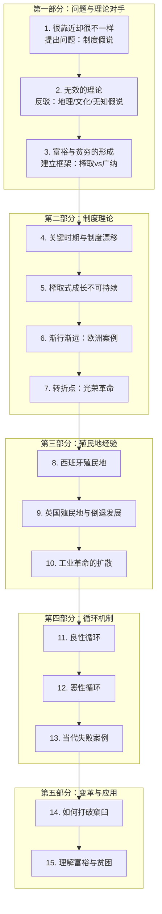

# 全书结构图

## 全书核心问题

为什么世界上有些国家富裕（如美国、英国、德国），有些国家极度贫困（如索马里、津巴布韦、北朝鲜）？这种悬殊的收入和生活水平差距从何而来？是否可以改变？

## 全书主论题

国家贫富的根源在于**制度**——那些规范经济游戏规则的政治制度。榨取式制度（extractive institutions）由少数精英控制，为精英利益服务，压制大多数人的创新和投资激励，从而导致贫困；广纳式制度（inclusive institutions）广泛分配政治权力、保护私有财产、开放竞争，使创意和创新得以发挥，最终带来普遍富裕。

制度不是唯一因素，但是最根本的因素。地理、文化、精英决策无知等解释都不充分。

## 逐章功能图

1. **第1章 很靠近却很不一样** — 开篇奠题：以诺加雷斯边境（美国vs墨西哥）案例提出核心问题，建立"制度是根本原因"的初步论点
2. **第2章 无效的理论** — 反驳竞争对手：系统批判地理假说、文化假说、"无知"假说，为制度解释扫清道路
3. **第3章 富裕与贫穷的形成** — 建立分析框架：提出榨取式与广纳式制度的区分，定义关键概念
4. **第4章 小差异和关键时期：历史的重量** — 解释机制（一）：引入"关键时期"和"制度漂移"概念，说明历史小差异如何通过关键时期放大
5. **第5章 榨取式制度下的成长** — 反驳"榨取也能成长"：论证苏联等案例的榨取式成长不可持续
6. **第6章 渐行渐远** — 历史案例（一）：从威尼斯、英国、东欧的分化说明制度漂移和关键时期如何导致西欧崛起
7. **第7章 转折点** — 历史案例（二）：英国光荣革命作为"关键时期"，建立广纳式制度
8. **第8章 别在我们的领土：发展的障碍** — 殖民地案例（一）：西班牙殖民地（墨西哥、秘鲁）如何建立榨取式制度
9. **第9章 倒退发展** — 殖民地案例（二）：英国对印度、澳大利亚的殖民如何带来倒退发展
10. **第10章 富裕的扩散** — 解释扩散：工业革命如何扩散，为什么有些社会抓住机会转型
11. **第11章 良性循环** — 机制分析（一）：广纳式制度如何产生自我强化的良性循环
12. **第12章 恶性循环** — 机制分析（二）：榨取式制度如何产生自我强化的恶性循环
13. **第13章 当前的国家为什么会失败** — 当代案例：津巴布韦、阿根廷、刚果等当代失败案例
14. **第14章 打破窠臼** — 变革条件：为什么榨取式制度难以打破，如何才能打破
15. **第15章 理解富裕与贫困** — 收束与应用：总结全书论点，反思政策含义

## 论证推进路径

## 章节类型标记

- **奠基章**：第1章（开篇）、第3章（核心概念框架）
- **反驳章**：第2章（反驳竞争理论）、第5章（反驳榨取也能持续成长）
- **推进章**：第4章（机制一）、第7章（机制二）、第11-12章（循环机制）
- **案例章**：第6章（欧洲）、第8-9章（殖民地）、第10章（扩散）、第13章（当代）
- **收束章**：第15章（总结与应用）

## 关键历史节点

| 节点 | 章节 | 意义 |
|------|------|------|
| 诺加雷斯边境 | Ch1 | 提出问题 |
| 光荣革命(1688) | Ch7 | 建立广纳式制度的关键时期 |
| 工业革命 | Ch10 | 制度差异导致不同发展结果 |
| 殖民扩张 | Ch8-9 | 移植榨取式制度的教训 |
