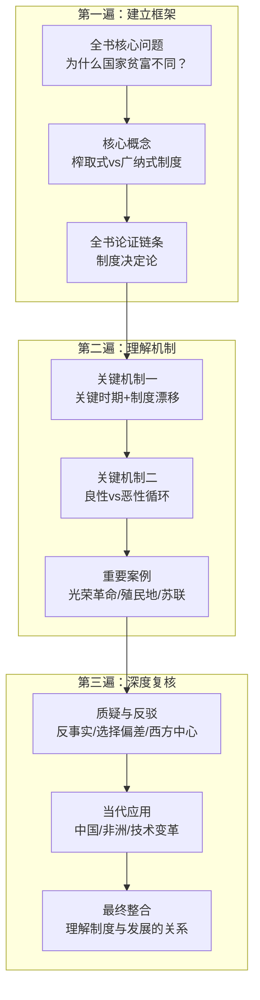

# 复习问题

## 基础理解

1. **第1章 很靠近却很不一样**：为什么诺加雷斯边境（美国/墨西哥）案例能说明制度是贫富根源？它反驳了哪些解释？
2. **第2章 无效的理论**：地理假说、文化假说、无知假说各自的核心论点是什么？作者用什么案例反驳它们？
3. **第3章 富裕与贫穷的形成**：什么是榨取式制度和广纳式制度？两者在政治和经济维度各有什么特征？
4. **第4章 关键时期与制度漂移**：什么是"关键时期"？什么是"制度漂移"？两者如何交互作用导致制度分叉？
5. **第5章 榨取式制度下的成长**：为什么说苏联式榨取式成长不可持续？其最终崩溃的机制是什么？
6. **第6章 渐行渐远**：威尼斯和英国分别代表了什么样的制度演变路径？为什么东欧走上了不同道路？
7. **第7章 转折点**：光荣革命（1688）为什么是关键时期？它如何建立起广纳式制度的框架？
8. **第8章 别在我们的领土**：西班牙殖民地的"赐封"（encomienda）制度是什么？它如何导致拉丁美洲的榨取式制度？
9. **第9章 倒退发展**：英国在印度和澳大利亚的殖民经验如何说明制度移植的影响？为什么印度从纺织强国变成原料产地？
10. **第10章 富裕的扩散**：工业革命为什么首先在英国发生？它如何扩散到其他社会？
11. **第11章 良性循环**：广纳式制度如何产生自我强化的反馈环？
12. **第12章 恶性循环**：榨取式制度如何产生自我强化的反馈环？为什么打破它特别困难？
13. **第13章 当前的国家为什么会失败**：津巴布韦、刚果等当代失败案例的共同制度特征是什么？
14. **第14章 打破窠臼**：为什么榨取式制度难以和平转型？打破它需要什么条件？
15. **第15章 理解富裕与贫困**：全书的核心命题是什么？政策制定者应该从本书学到什么？

## 论证追踪

1. **第1章**：从诺加雷斯案例到"制度是贫富根源"，作者经过了怎样的比较逻辑？有什么潜在的反驳？
2. **第2章**：作者反驳三大假说的论证结构是什么？哪个假说最难被彻底反驳？
3. **第3章**：广纳式/榨取式制度的区分是分析性的还是历史性的？这两类制度是二元对立还是光谱分布？
4. **第4章**：关键时期的论证是否存在"幸存者偏差"？作者是否选择性关注了产生好结果的关键时期？
5. **第5章**：苏联案例能否真正证明榨取式成长不可持续？或者只是特定条件下的结果？
6. **第7章**：光荣革命建立广纳式制度——这是历史的偶然还是结构性的必然？
7. **第11-12章**：良性循环和恶性循环的机制是对称的吗？为什么作者强调恶性循环比良性循环更难打破？
8. **第14章**：精英联盟的稳定性取决于哪些因素？有没有成功打破榨取式制度的历史案例（除英国外）？

## 概念辨析

1. **榨取式制度 vs 计划经济**：两者有何区别？是否存在"市场导向的榨取式制度"？
2. **广纳式政治制度 vs 民主**：选举式民主与广纳式政治制度是什么关系？委内瑞拉民主选举后为何仍是榨取式？
3. **关键时期 vs 路径依赖**：这两个概念如何区分又如何在历史分析中互补？
4. **制度漂移 vs 制度设计**：如果制度可以刻意设计，为什么许多社会不建立好制度？
5. **创意破坏 vs 渐进改良**：为什么作者认为创意破坏对长期进步至关重要，而不是渐进改良？
6. **精英联盟 vs 阶级利益**：精英联盟是超越阶级界线的吗？穷人是否可能成为精英联盟的一部分？
7. **榨取性成长 vs 包容性成长**：两者是二元对立还是可以在一定条件下并存？
8. **正式制度 vs 非正式制度**：作者对正式制度关注更多，但非正式制度（如腐败文化）的作用如何？

## 批判思考

1. **反事实困难**：作者的核心论证依赖反事实（"如果诺加雷斯两边制度互换"），但这种反事实如何能可靠地论证？
2. **选择偏差**：作者选取的案例是否过度选择有利于自己论证的案例？是否存在不支持论证的反例？
3. **西方中心主义**：批评者认为本书是"西方中心主义"——你是否同意？哪些论证可能存在这个问题？
4. **制度决定论过度**：本书是否过度强调制度而忽视其他因素（地理、技术、教育、国际环境）？
5. **殖民主义责任**：本书如何处理殖民主义的角色？制度差异在多大程度上是殖民主义造成的？
6. **当代政策含义**：本书对当代发展中国家的政策建议是什么？这些建议是否过于悲观或过于乐观？
7. **苏联/中国案例**：苏联已经崩溃，但中国仍在高速增长——这是否削弱了作者的论证？
8. **精英vs大众**：本书强调精英联盟的稳定性，但历史上有多少革命是由大众发动而非精英内部分裂引发的？

## 迁移应用

1. **分析当代中国**：用本书的制度框架分析当代中国的政治经济制度——它更接近榨取式还是广纳式？
2. **分析香港/新加坡**：这两个地区的经济发展成功用什么制度解释？它们是否有真正的广纳式政治制度？
3. **分析非洲案例**：博茨瓦纳vs尼日利亚的制度差异如何解释两国的不同发展结果？
4. **思考教育改革**：如果制度是关键，那么教育改革（而非政治改革）能带来真正的改变吗？
5. **思考技术变革**：AI和新技术革命是否可能改变制度的角色？新技术是否可能绕过坏制度？
6. **思考全球化**：全球化是否强化了某些国家的榨取式制度（如石油国家）还是帮助打破它们？
7. **思考历史相似性**：当代某些政治发展趋势（民粹主义、民族主义）是否可能导致广纳式制度倒退？
8. **思考个人选择**：在榨取式制度下，个人（如企业家、知识分子）如何行动才是最优策略？

## 记忆锚点

- **第1章**：诺加雷斯边境——同一地理/文化，不同制度，不同命运
- **第2章**：三大假说（地理/文化/无知）都被有效反驳——制度才是根本
- **第3章**：榨取式 vs 广纳式——权力是否广泛分配
- **第4章**：关键时期+制度漂移——历史小差异如何放大
- **第5章**：苏联榨取式成长不可持续的三个原因：创新激励缺失、资源配置扭曲、精英腐化
- **第6章**：威尼斯从广纳式退化为榨取式——制度不是单向进步的
- **第7章**：光荣革命（1688）——多元精英联盟+限制王权=广纳式制度基础
- **第8章**：赐封制度（encomienda）——美洲榨取式制度的原型
- **第9章**：印度纺织业衰落——殖民制度如何摧毁已有竞争优势
- **第10章**：英国之所以先发生工业革命——光荣革命+纺织技术+煤炭资源+殖民市场的组合
- **第11章**：良性循环的三个支柱——政治多元化、产权保护、竞争开放
- **第12章**：恶性循环的核心——精英联盟越紧密，制度越难改变
- **第13章**：津巴布韦穆加贝案例——榨取式制度如何自我强化
- **第14章**：打破榨取式制度的条件——精英分裂+广泛联盟+外部压力
- **第15章**：核心命题——制度是根本，但改变制度需要关键时期和正确条件

## 二刷路径图

## 各章回看优先级

| 优先级 | 章节 | 原因 |
|--------|------|------|
| ★★★ | 第3章 | 核心概念定义，影响全书 |
| ★★★ | 第4章 | 关键机制（关键时期） |
| ★★★ | 第7章 | 历史奠基（光荣革命） |
| ★★★ | 第11-12章 | 核心机制（循环） |
| ★★ | 第1-2章 | 开篇与铺垫 |
| ★★ | 第5章 | 反驳与边界 |
| ★★ | 第14章 | 当代意义 |
| ★ | 第6、8-10、13章 | 案例填充 |
