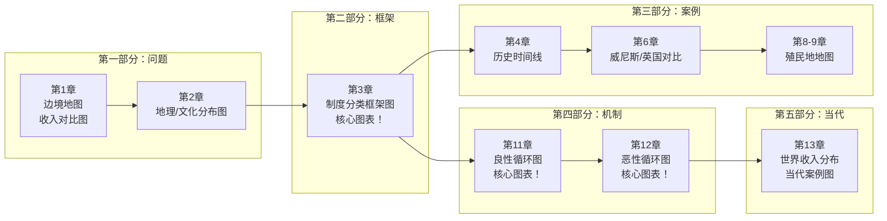

# 图表索引

## 概述

本书共识别到 **147 个视觉对象**，分布如下：

| 章节 | 图像数量 | 主要类型 |
|------|----------|----------|
| ch01 | ~23 | 边境地图、收入数据图 |
| ch02 | ~23 | 地理/文化假说相关图 |
| ch03 | ~18 | 制度分类框架图 |
| ch04 | ~15 | 历史时间线/地图 |
| ch05 | ~12 | 苏联/工业化图表 |
| ch06-15 | ~56 | 各类历史/当代案例图 |

**重要提醒**：EPUB提取的alt属性和caption信息大量缺失，图注多数无法确认。建议回看原书核对关键图表。

## 关键图表分类

### 1. 地图类

| 图号 | 章节 | 内容推测 | 可靠性 |
|------|------|----------|--------|
| 地图1-3 | Ch1 | 诺加雷斯边境位置图 | 中 |
| 地图4-5 | Ch2 | 世界地理/文化分布图 | 中 |
| 地图6 | Ch6 | 威尼斯/英国/东欧 | 低 |
| 地图7-9 | Ch8-9 | 西班牙殖民地分布 | 低 |
| 地图16 | Ch9 | 南非土地分配 | 低 |

### 2. 时间线类

| 图号 | 章节 | 内容推测 | 可靠性 |
|------|------|----------|--------|
| 时间线1 | Ch4 | 欧洲制度演变 | 低 |
| 时间线2 | Ch7 | 光荣革命进程 | 低 |

### 3. 数据图表类

| 图号 | 章节 | 内容推测 | 可靠性 |
|------|------|----------|--------|
| 图表1 | Ch1 | 美国/墨西哥边境收入对比 | 中 |
| 图表2 | Ch3 | 榨取vs广纳制度特征对比 | 中 |
| 图表3 | Ch5 | 苏联工业成长数据 | 低 |
| 图表4 | Ch13 | 当代国家GDP比较 | 低 |

### 4. 机制/流程图类

| 图号 | 章节 | 内容推测 | 可靠性 |
|------|------|----------|--------|
| 流程图1 | Ch11 | 良性循环反馈环 | 低 |
| 流程图2 | Ch12 | 恶性循环反馈环 | 低 |

## 建议回看的重要图表

### 高优先（建议先核对）

1. **第1章**：诺加雷斯边境地图——确认边境线位置和两侧经济数据
2. **第3章**：榨取式vs广纳式制度框架图——理解两维度四象限
3. **第11-12章**：良性/恶性循环机制图——理解制度自我强化逻辑
4. **第13章**：世界收入分布图——理解当代全球不平等

### 中优先

5. **第4章**：英国制度演变时间线
6. **第6章**：威尼斯衰落vs英国崛起对比
7. **第8章**：西班牙美洲殖民地地图

### 低优先（信息损失较多）

8. 其他历史地图和统计数据

## 视觉材料分布图（Mermaid）

## 无法识别的图表处理

由于EPUB提取限制，以下图表的详细内容建议回看原书：

1. **所有统计图表**：数字和具体数据需要回看原书确认
2. **所有地图**：边界、地名、图例需要回看原书确认
3. **机制图**：反馈环的具体变量和箭头关系需要回看原书确认

## 图表与论证的对应关系

| 图表 | 支撑哪个论证 |
|------|--------------|
| 诺加雷斯边境图 | 论证一（制度而非地理/文化） |
| 榨取vs广纳框架图 | 论证二（核心概念区分） |
| 光荣革命时间线 | 论证三（关键时期机制） |
| 苏联工业数据 | 论证四（榨取式成长不可持续） |
| 良性/恶性循环图 | 论证五（制度自我强化） |
| 殖民地地图 | 论证六（制度移植效应） |
| 世界收入分布 | 全书总结 |
