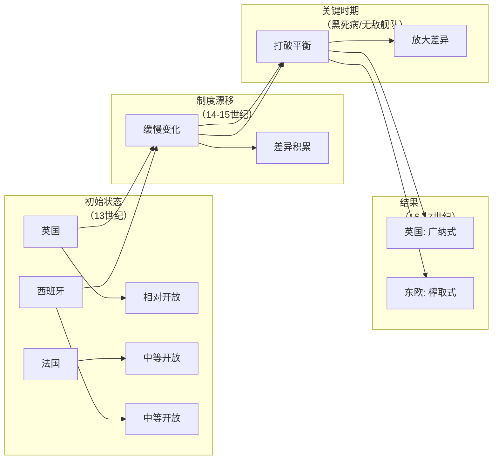

# 小差异和关键时期：历史的重量

## 本章在全书中的位置

**机制解释章（第一部分）**。本章是全书理论框架的核心章节之一——正式提出"关键时期"（critical junctures）和"制度漂移"（institutional drift）两个核心概念，解释初始制度差异如何通过历史节点被放大和锁定。

本章与前后章节的关系：
- 第3章（概念框架）→本章（机制解释一）→第5-6章（历史案例深化）
- 本章为第7章（光荣革命）做了关键铺垫

## 本章要回答的核心问题

**为什么初始条件相似的社会（如英国vs法国vs西班牙）在历史发展中走向不同的制度道路？历史小差异是如何被放大和锁定的？**

## 本章的核心主张

### 核心概念一：关键时期

**定义**：历史中特定的时间节点，在这些节点上社会面临重大选择，制度走向可能改变。

**特征**：
- 通常由外部冲击（瘟疫、战争、技术变革）引发
- 打破现有政治/经济力量平衡
- 产生的后果取决于既有的制度基础

**例子**：黑死病（1346）、无敌舰队（1588）、光荣革命（1688）

### 核心概念二：制度漂移

**定义**：制度随时间缓慢变化，不同社会因各自的历史路径而渐行渐远，即使没有重大事件发生。

**关键洞见**：制度差异不需要大的冲击来产生——微小差异会随时间积累。

### 核心论点：关键时期与制度漂移的交互作用

1. **初始差异很小**：英国、法国、西班牙在14世纪的制度差异并不显著
2. **制度漂移持续**：各国制度各自缓慢演变
3. **关键时期放大差异**：黑死病、无敌舰队等事件打破平衡，放大既有差异
4. **路径锁定**：放大后的差异变得难以逆转

## 论证链条拆解

### 步骤1：黑死病作为关键时期

**黑死病（1346-1351）的冲击**：
- 欧洲人口减少约三分之一
- 劳动力短缺→工资上升→封建领主面临压力

**为什么是"关键"**：
- 打破了封建秩序的既有平衡
- 创造了贵族与农民之间的新博弈
- 不同社会有不同的应对

### 步骤2：东西欧的分化

**共同冲击，不同反应**：

| | 西欧（英国） | 东欧（波兰、匈牙利） |
|---|---|---|
| 黑死病后 | 农民有足够力量挣脱压制 | 领主更强硬地维持农奴制 |
| 原因 | 农民有组织、能动员 | 领主相对更有组织 |
| 结果 | 封建制度松动→走向广纳式 | 农奴制强化→走向榨取式 |

**关键区分**：初始制度差异很小，但黑死病作为关键时期**放大**了这种差异。

### 步骤3：无敌舰队作为关键时期

**西班牙无敌舰队（1588）的失败**：
- 西班牙试图压制英格兰的崛起
- 英格兰意外获胜
- 大西洋贸易对英格兰更加开放

**为什么是"关键"**：
- 如果西班牙获胜，英格兰可能走向不同的制度道路
- 英格兰商人的崛起需要大西洋贸易的开放
- 多元政治力量（商人）的崛起需要这个关键时期

### 步骤4：制度漂移与路径锁定

**核心论证**：

1. **初始差异很小**：13世纪的英格兰、法国、西班牙制度大致相似
2. **漂移持续进行**：各国制度各自缓慢演变
3. **关键时期打破平衡**：黑死病、无敌舰队等事件
4. **差异被放大**：平衡打破后，原有差异被放大
5. **锁定成为路径**：被放大差异变得难以逆转

### 论证结构图

### 论证强度评估

**最强处**：
- 案例选择具有可比性（东西欧对比）
- 机制解释清晰（关键时期放大差异）
- 与第3章框架自然衔接

**最弱处**：
- "关键时期"的选择是否存在幸存者偏差？
- 论证依赖反事实（如果西班牙获胜...）

## 关键概念与概念区分

### 概念：关键时期（Critical Junctures）

- **定义**：历史中打破既有平衡、可能导致制度分叉的时间节点
- **本章作用**：解释为什么初始相似但后来走向不同
- **容易混淆**：与"决定论"混淆——关键时期产生什么结果仍有偶然性
- **关键区分**：关键时期不是"必然的"，而是"放大既有差异的"

### 概念：制度漂移（Institutional Drift）

- **定义**：制度随时间缓慢变化，不同社会渐行渐远
- **本章作用**：解释不需要大冲击，制度差异也会积累
- **容易混淆**：与"路径依赖"不同——漂移强调连续性，路径依赖强调锁定

### 概念：封建制度

- **定义**：欧洲中世纪基于土地和劳役的社会经济制度
- **本章作用**：作为东西欧对比的起点制度
- **容易混淆**：与"农奴制"混淆——西欧封建制度相对灵活，东欧农奴制更僵化

## 证据、案例与材料

### 证据1：黑死病与东西欧农民起义

- **类型**：历史案例
- **功能**：说明同一冲击在不同制度背景下产生不同结果
- **东欧**：领主更强硬维持农奴制（反应）
- **西欧**：农民获得更多自由（反应）
- **强度**：高（是真实历史比较）

### 证据2：英格兰vs法国/西班牙的内战与革命

- **类型**：历史案例
- **功能**：说明专制 vs 多元力量的博弈在不同社会有不同结果
- **英格兰**：多元力量（商人、新贵族）足够强大→光荣革命
- **法国**：专制相对更强→革命被压制
- **西班牙**：类似法国
- **强度**：高

### 证据3：无敌舰队（1588）

- **类型**：历史事件
- **功能**：说明偶然事件如何改变制度走向
- **机制**：西班牙失败→英格兰商业崛起→多元政治力量增强
- **强度**：中（是偶然性案例，但不能复制）

## 图像、图表与表格信息

EPUB提取未获取可靠图注，推测内容包括：
- **黑死病传播路线图**
- **无敌舰队航线图**（地图9）
- **14-17世纪欧洲制度比较图**

**建议**：回看原书核对第4章的地图和时间线

## 前提、限制与例外

### 作者隐含的前提

1. **我们可以识别"关键"时期**：假设某些历史事件比其他事件更重要
2. **初始差异是真实的**：假设14世纪欧洲各国制度确实大致相似
3. **历史不是完全随机的**：关键时期的结果部分取决于既有制度

### 适用范围

- 本章论证主要适用于**欧洲**的案例
- 对其他地区（亚洲、非洲）的适用性需要后续章节补充

### 作者承认的限制

- **偶然性确实存在**：无敌舰队的失败有很大运气成分
- **关键时期不是唯一因素**：制度漂移也在持续作用

## 容易被忽略的细节

### 细节1：黑死病的"相同冲击，不同反应"

黑死病对整个欧洲的冲击大致相同（人口减少三分之一），但：
- 西欧农民获得了更多自由
- 东欧农奴制反而强化

关键不是冲击本身，而是**既有的制度基础和力量对比**决定了反应方式。

### 细节2：无敌舰队的"如果"

作者强调：无敌舰队失败**不是必然的**。如果西班牙获胜，英格兰的历史可能完全不同。这是偶然性在历史中作用的案例。

### 细节3："制度漂移"比"关键时期"更基本

虽然关键时期很重要，但作者强调：**没有关键时期，制度漂移也会产生差异**。只是关键时期加速了差异的放大。

### 细节4：英格兰特殊论 vs 结构性解释

作者避免了简单的"英格兰特殊论"——英格兰不是因为有什么独特文化而走向广纳式，而是因为**结构性因素**（地理位置、制度基础、关键时期）共同作用。

## 一分钟回看

**本章核心洞见**：历史小差异会通过"关键时期"被放大和锁定。黑死病对欧洲的冲击相同，但东西欧的反应截然不同——因为它们的制度基础和力量对比不同。无无敌舰队失败改变了英格兰的命运，但这不是纯粹的偶然——它放大了英格兰已有的多元制度优势。制度差异不是一夜之间形成的，而是在漂移和关键时期的交互作用中逐渐积累和锁定的。

**值得回看**：第4章的"关键时期+制度漂移"框架是理解全书历史论证的基础。这个框架将贯穿第5-10章的所有历史案例。
