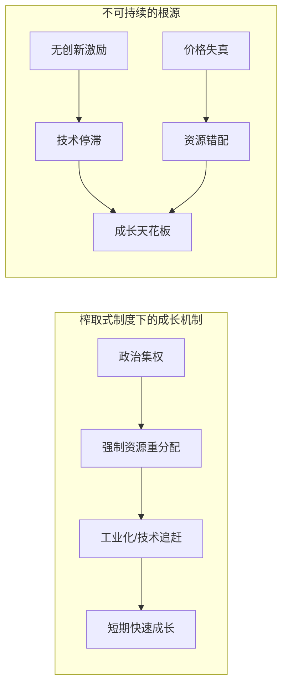
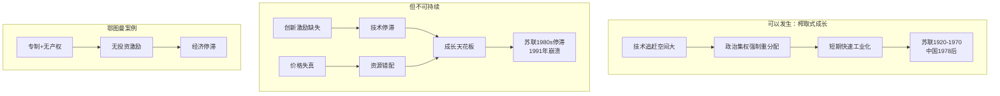

# 榨取式制度下的成长

## 本章在全书中的位置

**反驳与边界章**。本章是全书论证的关键一步——在建立"榨取式制度导致贫困"的论点后，本章探讨一个重要的边界情况：榨取式制度是否也能实现经济成长？如果能，为什么不可持续？

本章与前后章节的关系：
- 第4章（机制解释）→本章（反驳与边界）→第6章（历史案例深化）
- 本章为第12章（恶性循环）做了铺垫

## 本章要回答的核心问题

**榨取式制度能否实现经济成长？如果能，为什么这种成长不可持续？苏联的案例说明了什么？**

## 本章的核心主张

### 核心命题：榨取式成长不可持续

**作者明确承认**：榨取式制度在一定条件下确实可以创造经济成长。

**但这种成长有三个根本局限**：
1. **缺乏创新激励**：新技术威胁现有精英的利益，所以被压制
2. **资源配置扭曲**：资源分配由政治决定，而非市场效率
3. **无法持续**：当技术追赶空间耗尽，成长就会停滞

### 苏联案例：榨取式成长的原型

**苏联实现了什么**：
- 1920-1970年代：快速工业化
- 从农业国变成工业强国
- 军事和重工业达到相当水平

**为什么能实现**：
- **政治集权**：可以强制重新分配资源到工业
- **技术追赶**：苏联技术落后欧洲和美国，模仿空间大
- **劳动力重新配置**：从农业转移到工业

**为什么不可持续**：
- **缺乏创新激励**：创意破坏威胁现有精英
- **价格失真**：政府定价导致资源错配
- **最终崩溃**：1980年代停滞，1991年苏联解体

## 论证链条拆解

### 步骤1：鄂图曼帝国案例

**鄂图曼专制制度的特征**：
- 土地国有，无私有产权
- 包税制度（权力"出租"给个人）
- 税率极高（50-67%）

**为什么缺乏创新**：
- 产权不安全→不投资
- 高税率→没有动力努力工作
- 包税者只关心短期收益

### 步骤2：苏联的榨取式成长机制

**苏联做对了什么**：
- 政治集权建立秩序
- 强制工业化（重工业优先）
- 技术模仿（从西方引进）

**苏联做错了什么**：
- 计划经济无法正确计算价格
- 创新激励扭曲（创新红利计算方式有问题）
- 集体农庄压制农民积极性

**核心问题**：

### 步骤3：加勒比海蔗糖案例

**类似的机制**：
- 巴巴多斯、古巴、海地、牙买加
- 蔗糖生产需要大量奴隶劳动
- 把资源集中于单一作物

**为什么这是"榨取式成长"**：
- 不是因为效率，而是因为全球对蔗糖的需求
- 奴隶制让成本极低
- 但这是以人为代价的"成长"

**为什么不可持续**：
- 蔗糖价格波动→经济不稳定
- 没有技术变革或创新
- 最终殖民地制度瓦解

### 步骤4：改革尝试的失败

**苏联的多次改革尝试**：
- 1920年代：新经济政策（NEP）
- 1950-1960年代：利润分成改革
- 1970-1980年代：科技改革

**为什么都失败**：
- 都是技术性调整，没有改变根本激励结构
- 榨取式政治制度不允许真正的市场改革
- 精英害怕创意破坏

### 论证结构图

### 论证强度评估

**最强处**：
- 苏联案例是真实历史证据
- 机制分析清晰（激励扭曲）
- 与全书框架一致

**最弱处**：
- 中国案例尚未完全验证（中国1990-2020年代似乎仍在成长）
- 对"技术追赶空间"的大小没有明确标准
- 可能低估了榨取式制度下的渐进改良可能

## 关键概念与概念区分

### 概念：榨取性成长（Extractive Growth）

- **定义**：在榨取式制度下实现的经济成长，通常依赖资源重新分配或技术追赶
- **本章作用**：承认榨取式制度可以有成长，但论证其不可持续
- **容易混淆**：与"正常经济成长"混淆——榨取性成长的动力来自重新分配，而非创新

### 概念：技术追赶（Technological Catch-up）

- **定义**：发展中国家通过模仿先进技术实现快速成长
- **本章作用**：解释苏联早期成长的机制
- **关键限制**：技术追赶到一定阶段就会触及天花板

### 概念：价格失真（Price Distortion）

- **定义**：政府定价导致的价格偏离真实供需关系
- **本章作用**：解释计划经济为什么无法有效配置资源
- **关键**：市场价格是信息载体，政府无法正确获取和处理这些信息

### 概念：创意破坏恐惧（Fear of Creative Destruction）

- **定义**：精英害怕新技术和新模式会威胁他们现有的地位和利益
- **本章作用**：解释为什么榨取式制度会压制创新
- **关键**：这是榨取式制度最核心的自我毁灭机制

## 证据、案例与材料

### 证据1：苏联工业化（核心案例）

- **类型**：历史案例
- **功能**：说明榨取式成长可以发生但不可持续
- **关键机制**：政治集权+技术追赶→短期成长；创新激励缺失→长期停滞
- **强度**：高（是真实历史）

### 证据2：鄂图曼帝国（对比案例）

- **类型**：历史案例
- **功能**：说明专制+无产权→无投资激励
- **关键机制**：包税制度、高税率、产权不安全
- **强度**：中（是极端案例）

### 证据3：加勒比海蔗糖经济

- **类型**：历史案例
- **功能**：说明另一种类型的榨取式成长
- **关键机制**：奴隶劳动+单一作物+全球需求
- **强度**：中（是特定条件下的案例）

### 证据4：苏联改革尝试

- **类型**：反例
- **功能**：说明榨取式制度下的改革很难成功
- **关键机制**：都是技术性调整，未触及激励结构
- **强度**：高（是真实历史）

## 图像、图表与表格信息

EPUB提取未获取可靠图注，推测内容包括：
- **苏联工业成长数据图**
- **鄂图曼帝国领土扩张图**
- **加勒比海殖民地贸易路线图**

**建议**：回看原书核对第5章的统计图表

## 前提、限制与例外

### 作者隐含的前提

1. **创新是长期经济发展的关键**：没有创新，生产率无法持续提升
2. **精英确实会压制威胁其利益的技术**：这是结构性行为，而非个人选择
3. **计划经济无法有效配置资源**：政府无法获取和处理市场价格信息

### 适用范围

- **苏联案例**：适用于技术落后、政治集权的榨取式制度
- **中国案例**：作者暗示中国最终需要政治改革，但未明确定性

### 作者承认的例外

- **技术追赶在一定时期内是可能的**：如果技术足够落后
- **榨取式成长确实可以发生**：只是不可持续

## 容易被忽略的细节

### 细节1："榨取式成长"与"正常成长"的区别

榨取式成长的动力来源：
- 资源从农业重新分配到工业
- 从出口原材料换取工业品
- 技术模仿而非创新

正常成长的动力来源：
- 持续的技术创新
- 生产率提升
- 新产品和新市场的创造

### 细节2：苏联创新激励的具体扭曲

苏联的创新激励机制存在的问题：
- 创新红利与实际价值脱节
- 价格由政府设定，与真实价值无关
- 公司不愿意采用减少劳动力的技术（因为会影响就业）

### 细节3：鄂图曼包税制度

这是理解中东榨取式制度的关键：
- 政府把征税权"出租"给私人
- 包税者只关心在任期内收取最多税
- 没有动力改善长期生产

### 细节4：加勒比海案例的道德维度

蔗糖经济的"成长"是以奴隶劳动为代价的：
- 作者没有回避这个道德维度
- 但强调这在经济上也是不可持续的
- 最终殖民地制度瓦解

## 一分钟回看

**本章核心洞见**：榨取式制度可以实现经济成长，但这种成长不可持续。苏联的案例说明：通过政治集权强制资源重分配、技术追赶，可以在一定时期内实现快速工业化。但榨取式制度缺乏创新激励——因为新技术威胁现有精英的利益；同时价格失真导致资源错配。当技术追赶空间耗尽，成长就会停滞。榨取式成长的极限不是偶然的，而是制度结构决定的。

**值得回看**：第5章是理解全书"为什么榨取式制度长期贫困"的关键——它承认了榨取式制度可以有一时之需，但论证了为什么这种成长必然触顶。这为第12章（恶性循环）做了铺垫。
