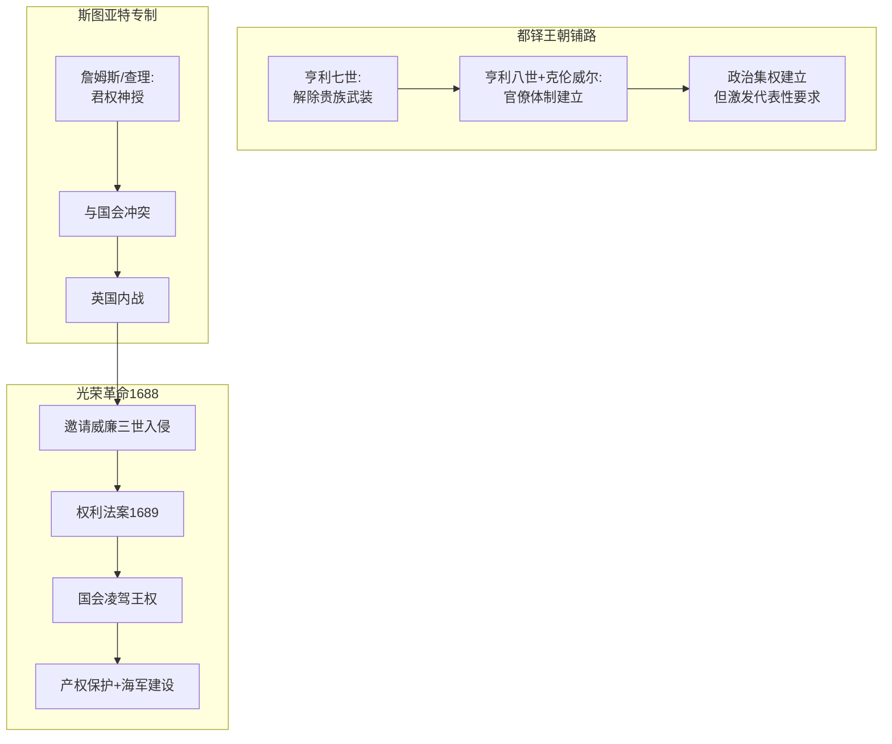

# 转折点

## 本章在全书中的位置

**历史案例章（第二部分）——全书最关键的奠基章节之一**。本章详细分析光荣革命（1688）如何建立起英格兰的广纳式政治制度，是理解全书论证的关键节点。

本章与前后章节的关系：
- 第6章（威尼斯/罗马案例）→本章（光荣革命）→第8-10章（殖民地案例）
- 本章是全书最重要的"历史奠基"章节——光荣革命建立了英格兰的广纳式制度基础

## 本章要回答的核心问题

**光荣革命（1688）为什么是关键时期？它如何建立起广纳式政治制度？这个制度有何特征？**

## 本章的核心主张

### 核心命题一：光荣革命是划时代的关键时期

**光荣革命（1688）的意义**：
- 终结了英格兰的专制统治
- 建立了国会凌驾王权的宪政原则
- 为工业革命奠定了制度基础

**为什么是关键时期**：
- 打破了斯图亚特王室的专制
- 权力从国王转移到国会（代表商人和新贵族）
- 为创意破坏和市场经济创造了制度空间

### 核心命题二：光荣革命建立了广纳式政治制度

**权利法案的核心条款**：
- 王位继承须经国会同意
- 未经国会同意不得征税
- 未经国会同意不得维持常备军
- 国会须经常召开

**制度变化的实质**：
- 权力从国王→转移到国会
- 国会的利益（商人、新贵族）与国王不同
- 国会成员投资贸易和工业→需要产权保护

### 核心命题三：都铎王朝为光荣革命铺路

**都铎王朝的贡献**：
- 亨利七世（1485-1509）：解除贵族武装，建立政治集权
- 亨利八世（1509-1547）+克伦威尔：建立官僚政府体制
- 解散修道院：削弱教会权力，进一步集权

**为什么是铺路**：
- 政治集权建立了政府能力
- 同时也激发了对政治代表性的要求
- 贵族和地方精英要求对集中权力有发言权

## 论证链条拆解

### 步骤1：都铎王朝的政治集权

**亨利七世**：
- 解除贵族武装
- 扩张中央政府权力
- 削弱地方封建势力

**亨利八世+克伦威尔**：
- 建立官僚政府体制
- 政府变成"长期机构"而非"国王御用机构"
- 解散修道院，没收教会土地

**为什么重要**：
- 建立了政治集权
- 同时激发了对政治代表性的要求

### 步骤2：斯图亚特王朝的专制倾向

**詹姆斯一世、查理一世**：
- 主张"君权神授"
- 试图绕过国会征税
- 与国会冲突导致内战

**查理二世、詹姆斯二世**：
- 继续专制倾向
- 试图恢复天主教
- 最终被光荣革命推翻

### 步骤3：光荣革命（1688）

**过程**：
- 詹姆斯二世试图恢复天主教
- 议会邀请威廉三世（荷兰）入侵
- 威廉击败詹姆斯，成为国王
- 权利法案（1689）确立国会至上

**关键**：
- 不是"改朝换代"，而是**权力结构的根本改变**
- 从"国王专制"变成"国会至上"

### 步骤4：光荣革命的商业影响

**国会成员的利益**：
- 大举投资贸易和工业
- 需要产权保护
- 需要海军保护海外商务

**制度变化的经济影响**：
- 国王不能再随意没收财产
- 关税和税收由国会控制
- 海军保护商业

### 论证结构图

### 论证强度评估

**最强处**：
- 历史事实清晰，论证链完整
- 机制解释详细（国会→商业利益→产权保护）
- 与全书框架完美契合

**最弱处**：
- 可能过度强调制度而忽略其他因素
- 商人利益是否真的能推动广纳式制度？

## 关键概念与概念区分

### 概念：权利法案（Bill of Rights, 1689）

- **定义**：英格兰1689年通过的宪法性文件，确立国会凌驾王权的原则
- **本章作用**：光荣革命的具体制度成果
- **关键条款**：不经国会同意不得征税、不得维持常备军、不得干涉法律

### 概念：政治集权与政治多元化的结合

- **定义**：广纳式政治制度需要两个条件：足够的政府集权（建立秩序）+政治多元化（防止权力滥用）
- **本章作用**：解释为什么光荣革命成功了
- **关键**：都铎建立集权，光荣革命建立多元化

### 概念：产权保护

- **定义**：政府不能随意没收个人财产
- **本章作用**：商业发展的制度基础
- **关键**：国会议员投资商业→需要产权保护→支持权利法案

## 证据、案例与材料

### 证据1：权利法案条款

- **类型**：原始文献
- **功能**：说明光荣革命的具体制度变化
- **关键**：王位继承、税收、常备军、国会召开

### 证据2：都铎王朝的制度变化

- **类型**：历史案例
- **功能**：说明光荣革命不是凭空出现
- **关键机制**：政治集权→激发代表性要求

### 证据3：商人和新贵族的崛起

- **类型**：经济史证据
- **功能**：解释为什么国会支持权利法案
- **关键**：商人和新贵族需要产权保护

## 图像、图表与表格信息

EPUB提取未获取可靠图注，推测内容包括：
- **光荣革命进程图**
- **都铎/斯图亚特王朝时间线**
- **英格兰宪政演变图**

## 前提、限制与例外

### 作者隐含的前提

1. **政治权力决定经济制度**：光荣革命改变了政治权力分配，从而改变了经济制度
2. **商人和新贵族的利益与广纳式制度一致**：他们需要产权保护
3. **光荣革命是结构性变化的开始**：不只是换了国王

### 适用范围

- 本章论证主要适用于**英格兰**
- 对其他社会的适用性需要具体分析

### 作者承认的限制

- 光荣革命有其偶然性（威廉三世恰好入侵成功）
- 不是所有社会都能复制英格兰的路径

## 容易被忽略的细节

### 细节1：权利法案的"暧昧"条款

权利法案有些条款是模糊的：
- "国会成员的选举应该自由"——如何界定"自由"？
- "国会应经常召开"——多久？

但这些模糊不是弱点，而是**必然的妥协**——当时没有人能预见所有未来情况。

### 细节2：威廉三世的让步

威廉三世主动放弃了许多以前国王的"权利"：
- 停止干预法律的决定
- 放弃终身关税权

这说明**权力真的转移了**，而不只是形式上的变化。

### 细节3：海军建设的经济意义

国会决定建设海军：
- 保护海外商务
- 这对有商业利益的国会议员有利
- 但也为后来的工业革命创造了条件

### 细节4：光荣革命不是孤立的

光荣革命之前：
- 大宪章（1215）
- 英国内战（1642-1651）

光荣革命之后：
- 权利法案（1689）
- 1717年英格兰银行成立
- 工业革命（1760s开始）

这是**一个长期过程**，光荣革命是其中的关键节点。

## 一分钟回看

**本章核心洞见**：光荣革命（1688）是英格兰成为第一个工业国家的制度基础。这场革命建立了国会凌驾王权的宪政原则，确立了产权保护，为商人和新贵族的利益提供了制度保障。都铎王朝之前的政治集权为这场革命奠定了基础——没有集权，就没有足够强大的政府；没有光荣革命，集权就会变成专制。光荣革命的关键不在于"换了国王"，而在于**权力结构发生了根本改变**，为创意破坏和市场经济发展创造了制度空间。

**值得回看**：第7章是理解全书论证的关键——光荣革命建立了广纳式政治制度，这是英格兰最终发生工业革命的制度基础。这为第10章（工业革命的扩散）做了铺垫。
