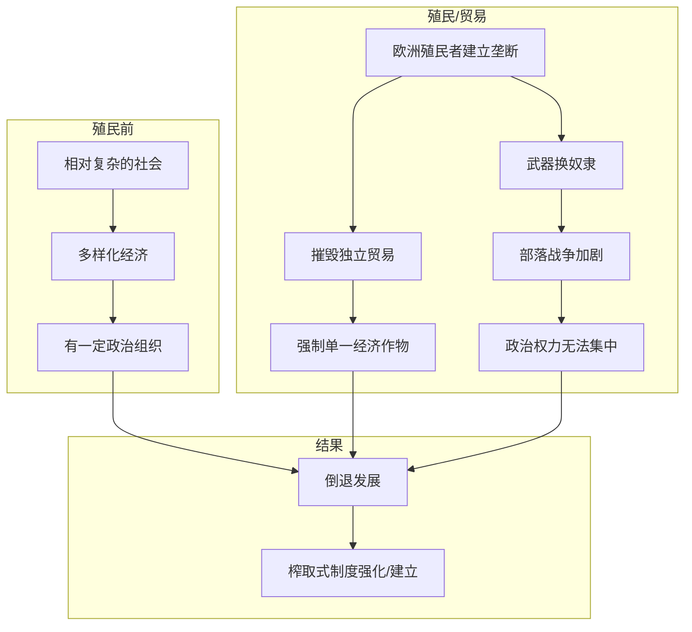

# 倒退发展

## 本章在全书中的位置

**殖民地案例章（第二部分）**。本章通过摩鹿加群岛、南非、塞拉利昂、刚果等案例，说明殖民主义如何制造或强化榨取式制度，导致"倒退发展"。

本章与前后章节的关系：
- 第8章（专制政权阻碍发展）→本章（殖民主义制造倒退）→第10章（工业革命扩散）

## 本章要回答的核心问题

**殖民主义如何制造或强化了榨取式制度？欧洲的殖民扩张对殖民地和宗主国产生了什么不同的影响？**

## 本章的核心主张

### 核心命题一：殖民主义强化了榨取式制度

**摩鹿加群岛案例**：
- 荷兰殖民者建立香料垄断
- 摧毁了当地独立政治实体
- 强制建立榨取式贸易制度

**南非案例**：
- 钻石/金矿发现→英国殖民扩张
- 布尔战争（1899-1902）
- 建立二元经济：白人农场+黑人劳工

### 核心命题二：奴隶贸易的长期影响

**大西洋奴隶贸易**：
- 非洲国家变成"战争机器"
- 为捕捉和贩卖奴隶而相互战争
- 政治权力无法集中

**塞拉利昂和利比里亚**：
- 表面上是"反奴隶制度"殖民地
- 实际上奴隶制度延续130年（1792-1928）

### 核心命题三："倒退发展"的机制

**为什么叫"倒退"**：
- 不是"没有发展"，而是"从相对好的状态变差"
- 殖民前某些地区（摩鹿加、刚果）有相对复杂的政治和经济
- 殖民后：制度被摧毁，变成极端榨取式

## 论证链条拆解

### 步骤1：摩鹿加群岛案例

**殖民前的状态**：
- 有一定程度的经济活动和贸易
- 相对独立的政治实体
- 多元化的社会结构

**殖民后的变化**：
- 荷兰建立香料垄断
- 摧毁独立贸易
- 强制建立单一作物经济

### 步骤2：南非的二元经济

**殖民前**：
- 相对多样化的部落经济
- 有土地和畜牧

**殖民后（钻石/金矿）**：
- 白人控制矿业
- 黑人被限制在"保留地"
- 80%职业对黑人不开放

**结果**：
- 二元经济：白人富裕+黑人贫困
- 种族隔离制度的前身

### 步骤3：奴隶贸易的政治影响

**非洲的"战争机器化"**：
- 为捕捉奴隶而战争
- 部落冲突加剧
- 政治权力无法集中

**为什么持续**：
- 欧洲商人提供枪支
- 激励持续战争
- 摧毁本土政治发展

### 论证结构图

## 关键概念与概念区分

### 概念：倒退发展（Reversal of Development）

- **定义**：从相对好的状态变差，制度从相对多元化变成极端榨取式
- **本章作用**：描述殖民主义的特殊影响
- **关键**：不是"没有发展"，而是"变得更糟"

### 概念：二元经济（Dual Economy）

- **定义**：一个国家内同时存在两个经济体系：现代部门和传统部门
- **本章作用**：描述南非等殖民地的经济结构
- **关键**：两个部门之间缺乏流动

### 概念：大西洋奴隶贸易

- **定义**：欧洲殖民者从非洲运输奴隶到美洲的贸易系统
- **本章作用**：说明殖民主义如何摧毁非洲政治发展
- **长期影响**：强化部落战争、摧毁政治集权

## 证据、案例与材料

### 证据1：摩鹿加群岛

- **类型**：历史案例
- **功能**：说明殖民主义如何摧毁已有经济
- **机制**：香料垄断→摧毁独立贸易
- **强度**：高

### 证据2：南非

- **类型**：历史案例
- **功能**：说明殖民主义如何建立二元经济
- **机制**：矿业→种族隔离→二元经济
- **强度**：高

### 证据3：塞拉利昂

- **类型**：历史案例
- **功能**：说明"反奴隶"殖民地如何延续奴隶制
- **机制**：名义上解放，实际上继续奴役
- **强度**：高

## 一分钟回看

**本章核心洞见**：殖民主义不是"带来发展"，而是制造或强化了榨取式制度。摩鹿加群岛的香料垄断、南非的二元经济、大西洋奴隶贸易——这些都是殖民主义的后果。关键洞见是"倒退发展"：殖民前相对复杂的社会被殖民后变成了极端榨取式制度，这不是"没有发展"，而是"变得更糟"。

**值得回看**：本章与第1章形成呼应——"命运逆转"和"倒退发展"是同一机制的不同表现：殖民时建立的制度类型决定了殖民后的发展轨迹。
