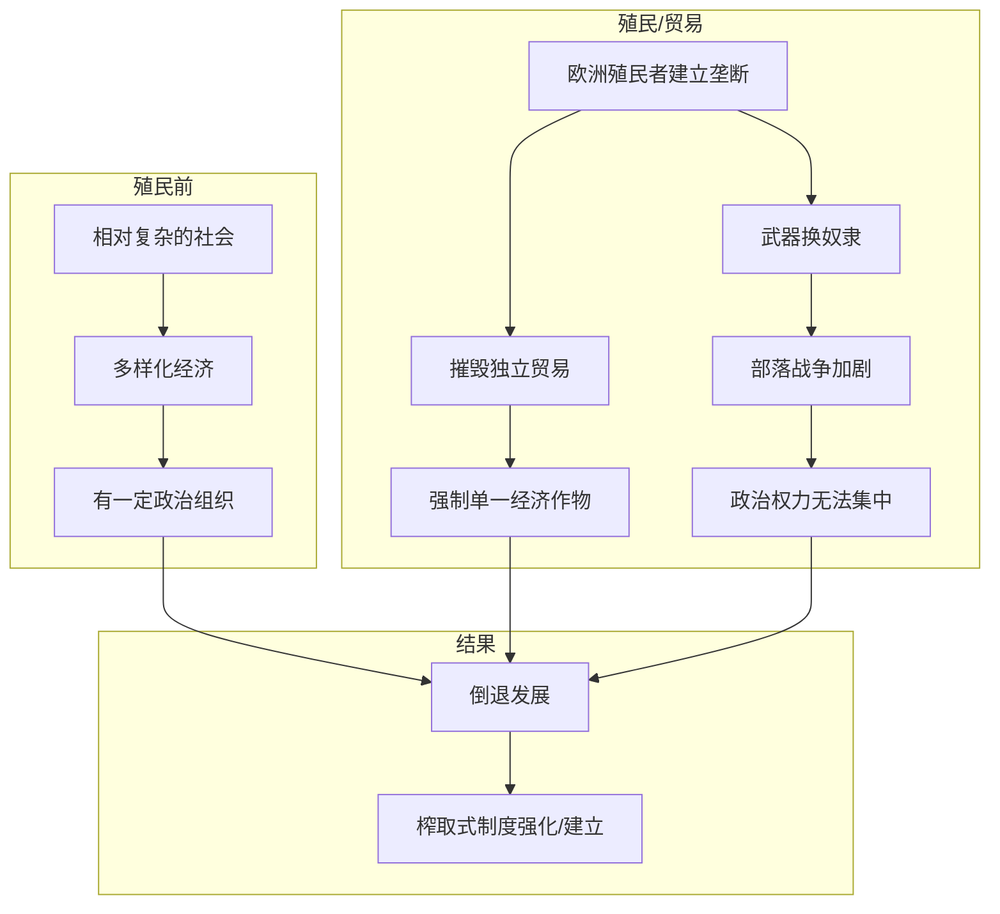

# 倒退发展

## 本章在全书中的位置

**殖民地案例章（第二部分）**。本章通过摩鹿加群岛、南非、塞拉利昂、刚果等案例，说明殖民主义如何制造或强化榨取式制度，导致"倒退发展"。

本章与前后章节的关系：
- 第8章（专制政权阻碍发展）→本章（殖民主义制造倒退）→第10章（工业革命扩散）

## 本章要回答的核心问题

**殖民主义如何制造或强化了榨取式制度？欧洲的殖民扩张对殖民地和宗主国产生了什么不同的影响？**

## 本章的核心主张

### 核心命题一：殖民主义强化了榨取式制度

**摩鹿加群岛案例**：
- 荷兰殖民者建立香料垄断
- 摧毁了当地独立政治实体
- 强制建立榨取式贸易制度

**南非案例**：
- 钻石/金矿发现→英国殖民扩张
- 布尔战争（1899-1902）
- 建立二元经济：白人农场+黑人劳工

### 核心命题二：奴隶贸易的长期影响

**大西洋奴隶贸易**：
- 非洲国家变成"战争机器"
- 为捕捉和贩卖奴隶而相互战争
- 政治权力无法集中

**塞拉利昂和利比里亚**：
- 表面上是"反奴隶制度"殖民地
- 实际上奴隶制度延续130年（1792-1928）

### 核心命题三："倒退发展"的机制

**为什么叫"倒退"**：
- 不是"没有发展"，而是"从相对好的状态变差"
- 殖民前某些地区（摩鹿加、刚果）有相对复杂的政治和经济
- 殖民后：制度被摧毁，变成极端榨取式

## 论证链条拆解

### 步骤1：摩鹿加群岛案例

**殖民前的状态**：
- 有一定程度的经济活动和贸易
- 相对独立的政治实体
- 多元化的社会结构

**殖民后的变化**：
- 荷兰建立香料垄断
- 摧毁独立贸易
- 强制建立单一作物经济

### 步骤2：南非的二元经济

**殖民前**：
- 相对多样化的部落经济
- 有土地和畜牧

**殖民后（钻石/金矿）**：
- 白人控制矿业
- 黑人被限制在"保留地"
- 80%职业对黑人不开放

**结果**：
- 二元经济：白人富裕+黑人贫困
- 种族隔离制度的前身

### 步骤3：奴隶贸易的政治影响

**非洲的"战争机器化"**：
- 为捕捉奴隶而战争
- 部落冲突加剧
- 政治权力无法集中

**为什么持续**：
- 欧洲商人提供枪支
- 激励持续战争
- 摧毁本土政治发展

### 论证结构图

## 关键概念与概念区分

### 概念：倒退发展（Reversal of Development）

- **定义**：从相对好的状态变差，制度从相对多元化变成极端榨取式
- **本章作用**：描述殖民主义的特殊影响
- **关键**：不是"没有发展"，而是"变得更糟"

### 概念：二元经济（Dual Economy）

- **定义**：一个国家内同时存在两个经济体系：现代部门和传统部门
- **本章作用**：描述南非等殖民地的经济结构
- **关键**：两个部门之间缺乏流动

### 概念：大西洋奴隶贸易

- **定义**：欧洲殖民者从非洲运输奴隶到美洲的贸易系统
- **本章作用**：说明殖民主义如何摧毁非洲政治发展
- **长期影响**：强化部落战争、摧毁政治集权

## 证据、案例与材料

### 证据1：摩鹿加群岛

- **类型**：历史案例
- **功能**：说明殖民主义如何摧毁已有经济
- **机制**：香料垄断→摧毁独立贸易
- **强度**：高

### 证据2：南非

- **类型**：历史案例
- **功能**：说明殖民主义如何建立二元经济
- **机制**：矿业→种族隔离→二元经济
- **强度**：高

### 证据3：塞拉利昂

- **类型**：历史案例
- **功能**：说明"反奴隶"殖民地如何延续奴隶制
- **机制**：名义上解放，实际上继续奴役
- **强度**：高

## 容易被忽略的细节

### 细节1：摩鹿加群岛的"香料与灭族"

**摩鹿加（Maluku Islands/Moluccas）**即今日印度尼西亚的马鲁古群岛，是著名的"香料群岛"。

**殖民前的状态**：
- 班达群岛（Banda Islands）的肉豆蔻（nutmeg）产量占全球90%以上
- 特罗恩（Ternate）和蒂多雷（Tidore）苏丹国之间存在竞争，但也维持着多元贸易网络
- 当地苏丹国与中国、阿拉伯、印度的商人都有往来，形成了相对复杂的贸易体系
- 葡萄牙人（1512年）和后来的荷兰人（1602年设立东印度公司）先后到来

**荷兰的垄断机制（1602-1799）**：
- 荷兰东印度公司（VOC）获得了荷兰议会授予的垄断特权
- 1621年，荷兰对班达群岛发动"班达群岛远征"（Banda Expedition），屠杀约15,000名居民（总人口约15,000-18,000）
- 幸存者被强制劳动为荷兰人种植肉豆蔻
- 荷兰人还强制销毁其他地区的肉豆蔻树，只允许班达群岛生产，以维持垄断价格

**为什么是"灭族"**：
- 班达群岛的原住民几乎被屠杀殆尽
- 幸存者成为荷兰种植园的强制劳动者
- 殖民前的多元贸易体系被完全摧毁，替换为单一作物的垄断种植制度

**关键机制**：荷兰东印度公司不是为了"发展"当地经济，而是为了将香料利润输回荷兰。这导致了极端榨取式制度的建立。

### 细节2：南非二元经济的形成

**殖民前的南非**：
- 科伊科伊人（Khoikhoi）和桑人（San）从事畜牧和狩猎
- 祖鲁人、科萨人等班图语系民族在东开普敦地区有相对稳定的社会组织
- 荷兰东印度公司在1652年在好望角建立补给站，最初只是想建立一个商站

**荷兰殖民的演变**：
- 1652年：荷兰东印度公司职员扬·范里贝克（Jan van Riebeeck）在好望角建立补给站
- 1657年：公司开始授予自由黑人（Free Black）土地，但这些人后来受到越来越严苛的限制
- 1700年代：布尔人（Boers，荷兰裔殖民者后裔）开始向内陆扩张
- 1770年代：英国人开始介入，开普敦成为英国殖民地（1795年）

**钻石/金矿发现（1867/1886）的转折**：
- 1867年，在金伯利（Kimberley）发现钻石
- 1886年，在威特沃特斯兰（Witwatersrand）发现金矿
- 英国殖民者通过"扬格委员会"（Wanderes Commission）和两次布尔战争（1880-1881，1899-1902）最终确立了英国对南非的控制

**二元经济的制度设计**：
- 土地剥夺：黑人被限制在"保留地"（later "homelands"），白人农场主控制了最好的土地
- 通行证法（Pass Laws）：黑人需要携带通行证才能在"白人的地区"工作
- 矿工劳动制度：黑人矿工签订合同，报酬极低，且被限制在特定工种
- 80%的职业对黑人完全不开放——这是法律规定的种族隔离

**布尔战争（1899-1902）的后果**：
- 英国战胜，但允许布尔人保留种族隔离制度作为妥协
- 1902年《弗里尼欣条约》（Treaty of Vereeniging）确认了这种安排
- 这为后来的 apartheid（1948-1994）种族隔离制度奠定了基础

### 细节3：大西洋奴隶贸易与非洲"战争机器化"

**大西洋奴隶贸易的规模**：
- 1500-1900年间，约有1200万非洲人被运往美洲
- 其中约10%在运输途中死亡
- 最大的接收地：巴西（约500万）、加勒比海（约400万）、北美（约30万）

**非洲政治被扭曲的过程**：
- 欧洲商人用枪支、火药、酒精换取奴隶
- 沿海非洲王国（如达荷美、贝宁）成为"奴隶狩猎"的组织者
- 内地部落为了获得枪支，开始互相攻击俘虏奴隶
- 这种"战争机器化"摧毁了非洲国家正常政治发展的可能性

**为什么持续这么久**：
- 欧洲商人的需求持续存在
- 非洲精英从奴隶贸易中获益（枪支、奢侈品）
- 没有外部力量能够阻止这种贸易（直到1807年英国禁止）

**塞拉利昂的特殊案例**：
- 1792年由英国"反奴隶制度协会"建立，目的是安置获释奴隶
- 但实际上，塞拉利昂公司（ Sierra Leone Company）将获释奴隶当作劳动力使用
- 1820年代起，英国海军拦截的奴隶船上的非洲人被运到这里
- 这些人被迫在极度恶劣的条件下劳动，很多人在前几年就死亡
- 奴隶制度在这里以不同形式延续了130年，直到1928年

### 细节4："倒退发展"与"没有发展"的区别

**殖民前的摩鹿加群岛**：
- 有多样化的贸易网络（香料、鱼类、纺织品）
- 有相对复杂的政治组织（苏丹国之间的外交和竞争）
- 与亚洲其他地区有广泛的经济联系

**殖民后的摩鹿加群岛**：
- 单一作物经济（香料垄断）
- 政治组织被摧毁（荷兰人直接统治）
- 与外部世界的联系被限制在荷兰东印度公司

**这不是"没有发展"，而是"倒退"**：
- 如果没有荷兰殖民，当地的贸易网络可能进一步发展
- 殖民打断了本地的自然发展轨迹
- 在某些地区，殖民前的社会已经比殖民后更复杂

## 论证强度评估

**最强处**：
- 案例选择具有代表性（摩鹿加=亚洲、南非=非洲、塞拉利昂=非洲）
- 机制解释清晰（垄断→摧毁独立贸易；枪支→部落战争）
- 与全书框架自然衔接

**最弱处**：
- "倒退发展"的概念是否适用于所有殖民地？（有些地区确实没有发展）
- 是否低估了殖民带来的一些"现代化"（如铁路、医疗）？

## 前提、限制与例外

### 作者隐含的前提

1. **殖民前存在可被摧毁的制度**：假设摩鹿加群岛在荷兰到来前有相对复杂的社会
2. **欧洲人有能力强制实施垄断**：假设殖民者有足够的军事力量
3. **殖民地人民无法抵抗**：假设没有有效的本地抵抗

### 适用范围

- 本章论证主要适用于**亚洲和非洲**的荷兰、英国、法国殖民地
- 不适用于西班牙在拉丁美洲的殖民地（那里的制度相对多元）

### 作者承认的限制

- **殖民主义不是唯一因素**：有些地区在被殖民前已经存在问题
- **内部因素也很重要**：非洲的部落冲突在被欧洲人介入前就已存在

## 图像、图表与表格信息

EPUB提取未获取可靠图注，推测内容包括：
- **摩鹿加群岛地图**（标注香料产地）
- **大西洋奴隶贸易路线图**
- **南非种族隔离制度示意图**

**建议**：回看原书核对第9章的地图和时间线

## 一分钟回看

**本章核心洞见**：殖民主义不是"带来发展"，而是制造或强化了榨取式制度。摩鹿加群岛的香料垄断、南非的二元经济、大西洋奴隶贸易——这些都是殖民主义的后果。关键洞见是"倒退发展"：殖民前相对复杂的社会被殖民后变成了极端榨取式制度，这不是"没有发展"，而是"变得更糟"。

**值得回看**：本章与第1章形成呼应——"命运逆转"和"倒退发展"是同一机制的不同表现：殖民时建立的制度类型决定了殖民后的发展轨迹。
