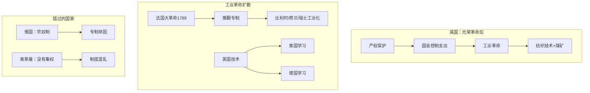

# 富裕的扩散

## 本章在全书中的位置

**历史案例章（第三部分）**。本章解释工业革命为什么首先在英国发生，以及它如何扩散到其他社会。

本章与前后章节的关系：
- 第9章（殖民主义与倒退发展）→本章（工业革命与扩散）→第11-12章（循环机制）

## 本章要回答的核心问题

**工业革命为什么首先在英国发生？它如何扩散到其他社会？为什么有些社会能够抓住机会，有些错过了？**

## 本章的核心主张

### 核心命题一：英国首先发生工业革命的条件

**光荣革命（1688）建立的条件**：
- 产权保护
- 政治集权+多元化
- 国会控制政府支出

**为什么是英国**：
- 英格兰已经有相对广纳式的制度
- 地理条件（煤矿）提供了能源
- 大西洋贸易创造了广阔市场

### 核心命题二：工业革命的扩散

**法国大革命（1789）**：
- 推翻专制→为工业化开路
- 法国军队→强制输出新制度到比利时、荷兰、瑞士等

**为什么有些国家抓住了机会**：
- 有一定的政治集权
- 能够学习新技术
- 制度相对开放

**为什么有些国家错过了**：
- 专制政权压制创新（俄国、奥匈帝国）
- 没有政治集权（奥斯曼帝国）
- 被殖民的国家

### 核心命题三：澳大利亚的独特案例

**罪犯流放殖民地**：
- 最初：强迫劳动制度
- 失败：缺乏激励
- 后来：给罪犯经济自由

**为什么形成更广纳的制度**：
- 需要激励罪犯工作
- 罪犯可以自由交易
- 形成市场经济基础

## 论证链条拆解

### 步骤1：工业革命的前提

**光荣革命（1688）**：
- 国会至上
- 产权保护
- 稳定的政治环境

**市场条件**：
- 大西洋贸易
- 煤矿接近工业中心
- 相对开放的社会

### 步骤2：法国大革命

**为什么是"扩散"**：
- 推翻专制
- 拿破仑战争→强制输出制度
- 比利时、荷兰、瑞士变成相对开放

**为什么俄国等没有抓住机会**：
- 专制更顽固
- 农奴制阻碍工业化
- 拿破仑失败后专制复辟

### 步骤3：澳大利亚案例

**罪犯殖民地的演变**：
- 强迫劳动（不成功）
- 给罪犯经济自由
- 更开放的市场经济

**关键洞见**：**澳大利亚的广纳式制度部分是因为罪犯劳动激励问题的解决方案**

### 论证结构图

## 关键概念与概念区分

### 概念：工业革命

- **定义**：18世纪末开始在英国的技术和经济变革
- **本章作用**：解释为什么英国首先发生
- **关键要素**：技术创新+制度环境

### 概念：扩散（Diffusion）

- **定义**：工业革命从英国传播到其他社会的过程
- **本章作用**：说明为什么有些国家抓住了机会
- **关键机制**：制度+学习能力

## 证据、案例与材料

### 证据1：法国大革命

- **类型**：历史案例
- **功能**：说明专制政权如何被推翻，为工业化开路
- **机制**：拿破仑战争→制度输出
- **强度**：高

### 证据2：澳大利亚

- **类型**：历史案例
- **功能**：说明罪犯殖民地如何形成更广纳的制度
- **机制**：激励问题→经济自由
- **强度**：中

## 容易被忽略的细节

### 细节1：为什么是英国而不是其他国家？

**英国的特殊条件**：

1. **光荣革命（1688）的具体内容**：
   - 1688年，威廉三世（William of Orange）从荷兰入侵英格兰，推翻詹姆斯二世（James II）
   - 《权利法案》（Bill of Rights 1689）确立了议会至上原则
   - 1690年，托马斯·朗福德（Thomas Longueville）的研究显示，关键不是威廉三世本身，而是议会权力的确立

2. **英格兰的特殊地理条件**：
   - 煤矿分布在纽卡斯尔（Newcastle）到伯明翰（Birmingham）的区域
   - 这些煤矿距离工业中心非常近，降低了运输成本
   - 相比之下，法国和德国的煤矿分布更分散

3. **大西洋贸易的规模**：
   - 1688年，英格兰的海外贸易额约为法国的两倍
   - 英国东印度公司（1600年成立）在印度建立了贸易据点
   - 三角贸易（奴隶-糖-棉花）为英国工业革命提供了原始资本

**为什么不是荷兰？**：
- 荷兰的制度虽然相对开放，但荷兰本身太小，缺乏足够的煤炭资源
- 荷兰的金融制度（阿姆斯特丹银行）非常发达，但这也意味着荷兰更专注于金融而非制造业
- 荷兰在1672年的"灾难年"（Rampjaar）中被法国击败，结束了荷兰的霸权

**为什么不是法国？**：
- 法国有丰富的煤炭资源（北部和东部），但专制制度压制了创新
- 法国的手工业行会（guilds）权力很大，阻碍了技术变革
- 法国的大西洋贸易受到政府的严格控制

### 细节2：法国大革命的制度扩散机制

**法国大革命（1789）的直接后果**：
- 1792年：法兰西第一共和国成立
- 1793-1794年：雅各宾派专政（恐怖统治），处决约17,000人
- 1799年：拿破仑·波拿巴发动雾月政变，成为第一执政
- 1804年：拿破仑称帝，建立法兰西第一帝国

**拿破仑战争的制度输出**：
- 拿破仑通过战争将法国的法律制度（拿破仑法典）传播到被占领国家
- 在比利时、荷兰、瑞士、意大利北部，拿破仑强制实施了拿破仑法典
- 这些地区在拿破仑倒台后，保留了拿破仑法典中确立的财产权和合同权
- 比利时和荷兰因此建立了相对广纳式的制度，为19世纪的工业化奠定了基础

**为什么俄国错过了**：
- 拿破仑战争中，俄国在1812年莫斯科撤退后击败了法国
- 但俄国国内制度没有根本改变——农奴制仍然存在
- 沙皇亚历山大一世在维也纳会议（1815）中恢复了欧洲的君主制
- 俄国专制制度得到加强，工业化被推迟

### 细节3：澳大利亚罪犯殖民地的制度演变

**澳大利亚殖民的历史**：
- 1788年：英国在澳大利亚建立第一个殖民地（新南威尔士）
- 最初是作为罪犯流放地——英国监狱人满为患，需要一个替代场所
- 头几年，罪犯被强制劳动，但效率极低

**激励问题的解决方案**：
- 1790年代，殖民地开始给罪犯分配小块土地
- 罪犯可以用自己的时间耕种，超额产出归自己
- 这创造了激励——罪犯开始主动工作
- 到1800年代，澳大利亚开始出口小麦和羊毛

**为什么这导致了更广纳的制度**：
- 经济自由需要法律框架来保护产权
- 罪犯可以自由交易，创造了市场网络
- 商人和贸易商开始进入殖民地
- 到1820年代，澳大利亚已经有了相对开放的经济制度

**关键洞见**：制度变革有时候不是因为理念的进步，而是因为实践问题的解决方案碰巧产生了更开放的结果。

### 细节4：明治维新与制度模仿

**为什么日本成功了**：
- 1853年：美国黑船事件，马修·佩里（Matthew Perry）强迫日本开放贸易
- 1868年：明治维新推翻了德川幕府，建立了明治政府
- 明治政府的策略：主动学习和模仿西方制度

**具体措施**：
- 1871年：派出岩仓使团（Iwakura Mission）访问欧美，学习西方制度
- 1873年：实施地租改革（Ground Rent Reform），确立土地私有制
- 1889年：颁布《大日本帝国宪法》，确立了君主立宪制
- 1890年代：建立现代银行体系和工厂制度

**为什么这是"广纳式"的**：
- 地主和商人被纳入新的政治经济体系
- 明治宪法虽然保留了天皇的象征性权力，但建立了议会和选举制度
- 商业阶层获得了政治影响力

**关键洞见**：明治维新成功不是因为日本文化特殊，而是因为主动学习和制度模仿。

## 论证强度评估

**最强处**：
- 解释了工业革命为什么在英国而不是其他国家发生
- 机制分析清晰（光荣革命→产权保护→技术创新）
- 与第4章的"关键时期"框架自然衔接

**最弱处**：
- 地理因素（煤矿）的作用是否被高估？
- 澳大利亚案例是否具有普遍性？

## 前提、限制与例外

### 作者隐含的前提

1. **工业革命需要制度条件**：假设广纳式制度是工业革命的前提
2. **技术可以扩散**：假设其他国家可以学习英国的技术
3. **制度可以被主动改变**：假设政府可以通过改革建立更广纳的制度

### 适用范围

- 本章论证主要适用于**欧洲和美洲**的工业化案例
- 对亚洲的适用性需要进一步分析（日本、韩国vs中国、印度）

### 作者承认的限制

- **技术不是充分条件**：很多国家有技术但没有发生工业革命
- **制度变革的时机很重要**：太早或太晚都可能失败

## 图像、图表与表格信息

EPUB提取未获取可靠图注，推测内容包括：
- **英国工业革命时期地图**（标注煤矿位置）
- **拿破仑战争扩散图**
- **明治维新时期日本地图**

**建议**：回看原书核对第10章的地图和时间线

## 一分钟回看

**本章核心洞见**：工业革命首先在英国发生，因为光荣革命建立了产权保护和稳定的政治环境。工业革命的扩散取决于目标社会的制度条件——法国大革命推翻了专制，为工业化开路；俄国、奥匈帝国因为专制顽固而错过。澳大利亚的案例说明，激励问题可以推动制度向更广纳的方向演变。

**值得回看**：本章解释了为什么有些国家能够工业化，有些错过了。这是理解第11-12章（良性/恶性循环）的基础——能够工业化的国家进入良性循环，错过的国家陷入恶性循环。
