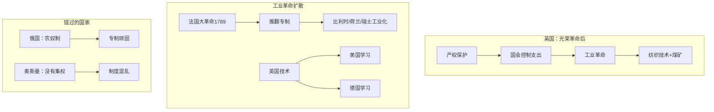

# 富裕的扩散

## 本章在全书中的位置

**历史案例章（第三部分）**。本章解释工业革命为什么首先在英国发生，以及它如何扩散到其他社会。

本章与前后章节的关系：
- 第9章（殖民主义与倒退发展）→本章（工业革命与扩散）→第11-12章（循环机制）

## 本章要回答的核心问题

**工业革命为什么首先在英国发生？它如何扩散到其他社会？为什么有些社会能够抓住机会，有些错过了？**

## 本章的核心主张

### 核心命题一：英国首先发生工业革命的条件

**光荣革命（1688）建立的条件**：
- 产权保护
- 政治集权+多元化
- 国会控制政府支出

**为什么是英国**：
- 英格兰已经有相对广纳式的制度
- 地理条件（煤矿）提供了能源
- 大西洋贸易创造了广阔市场

### 核心命题二：工业革命的扩散

**法国大革命（1789）**：
- 推翻专制→为工业化开路
- 法国军队→强制输出新制度到比利时、荷兰、瑞士等

**为什么有些国家抓住了机会**：
- 有一定的政治集权
- 能够学习新技术
- 制度相对开放

**为什么有些国家错过了**：
- 专制政权压制创新（俄国、奥匈帝国）
- 没有政治集权（奥斯曼帝国）
- 被殖民的国家

### 核心命题三：澳大利亚的独特案例

**罪犯流放殖民地**：
- 最初：强迫劳动制度
- 失败：缺乏激励
- 后来：给罪犯经济自由

**为什么形成更广纳的制度**：
- 需要激励罪犯工作
- 罪犯可以自由交易
- 形成市场经济基础

## 论证链条拆解

### 步骤1：工业革命的前提

**光荣革命（1688）**：
- 国会至上
- 产权保护
- 稳定的政治环境

**市场条件**：
- 大西洋贸易
- 煤矿接近工业中心
- 相对开放的社会

### 步骤2：法国大革命

**为什么是"扩散"**：
- 推翻专制
- 拿破仑战争→强制输出制度
- 比利时、荷兰、瑞士变成相对开放

**为什么俄国等没有抓住机会**：
- 专制更顽固
- 农奴制阻碍工业化
- 拿破仑失败后专制复辟

### 步骤3：澳大利亚案例

**罪犯殖民地的演变**：
- 强迫劳动（不成功）
- 给罪犯经济自由
- 更开放的市场经济

**关键洞见**：**澳大利亚的广纳式制度部分是因为罪犯劳动激励问题的解决方案**

### 论证结构图

## 关键概念与概念区分

### 概念：工业革命

- **定义**：18世纪末开始在英国的技术和经济变革
- **本章作用**：解释为什么英国首先发生
- **关键要素**：技术创新+制度环境

### 概念：扩散（Diffusion）

- **定义**：工业革命从英国传播到其他社会的过程
- **本章作用**：说明为什么有些国家抓住了机会
- **关键机制**：制度+学习能力

## 证据、案例与材料

### 证据1：法国大革命

- **类型**：历史案例
- **功能**：说明专制政权如何被推翻，为工业化开路
- **机制**：拿破仑战争→制度输出
- **强度**：高

### 证据2：澳大利亚

- **类型**：历史案例
- **功能**：说明罪犯殖民地如何形成更广纳的制度
- **机制**：激励问题→经济自由
- **强度**：中

## 一分钟回看

**本章核心洞见**：工业革命首先在英国发生，因为光荣革命建立了产权保护和稳定的政治环境。工业革命的扩散取决于目标社会的制度条件——法国大革命推翻了专制，为工业化开路；俄国、奥匈帝国因为专制顽固而错过。澳大利亚的案例说明，激励问题可以推动制度向更广纳的方向演变。

**值得回看**：本章解释了为什么有些国家能够工业化，有些错过了。这是理解第11-12章（良性/恶性循环）的基础——能够工业化的国家进入良性循环，错过的国家陷入恶性循环。
