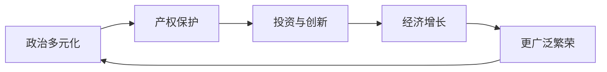

# 良性循环

## 本章在全书中的位置

**机制分析章（第一部分）**。本章系统分析广纳式制度如何产生自我强化的良性循环。

本章与前后章节的关系：
- 第10章（工业革命扩散）→本章（良性循环机制）→第12章（恶性循环）

## 本章要回答的核心问题

**广纳式制度如何产生自我强化的循环？为什么这种循环不是必然的，而是依赖于关键时期和偶然性？**

## 本章的核心主张

### 核心命题一：良性循环的三个支柱

**政治多元化→经济广纳性→更广泛繁荣→政治多元化强化**

1. **政治多元化**：权力广泛分配，限制任何人垄断权力
2. **经济广纳性**：产权保护、竞争开放、创意破坏
3. **更广泛繁荣**：更多人分享经济成果

### 核心命题二：良性循环的机制

**为什么是"自我强化"**：
- 政治多元化→限制精英垄断→保护产权
- 保护产权→投资和创新→经济增长
- 经济增长→更多人变富→要求更多政治参与
- 更多政治参与→政治多元化加强

### 核心命题三：良性循环不是必然的

**威尼斯的反例**：
- 中世纪：相对广纳式
- 1688年后：退化为寡头制度
- 与英格兰的路径分歧

**关键洞见**：**即使有良性循环，也可能被关键时期逆转**

## 论证链条拆解

### 步骤1：良性循环的结构

### 步骤2：为什么会自我强化

- 多元政治→没有群体能垄断权力→产权保护→投资增加→增长
- 增长→中产阶级扩大→要求更多政治参与→多元政治强化

### 步骤3：关键时期的逆转可能

**威尼斯案例**：
- 中世纪有广纳式特征
- 商业精英形成寡头联盟
- 1688年后退化为榨取式

**关键**：**不是所有广纳式制度都会持续强化，也可能会退化**

### 步骤4：历史的偶然性

**光荣革命的偶然性**：
- 1588年西班牙无敌舰队失败
- 不是"必然的"历史规律
- 是偶然事件改变了制度走向

**关键时期的outcome取决于**：
- 既有的制度基础
- 既有政治力量的对比
- 具体的偶然事件

## 关键概念与概念区分

### 概念：良性循环（Virtuous Circle）

- **定义**：广纳式制度如何产生自我强化的正向反馈
- **本章作用**：解释为什么有些国家能够持续富裕
- **机制**：政治多元化→经济广纳→广泛繁荣→政治多元化

### 概念：寡头铁律（Iron Law of Oligarchy）

- **定义**：组织倾向于被少数精英控制，无论其最初是多么民主
- **本章作用**：解释为什么良性循环不是必然的
- **关键**：精英联盟可能扼杀多元化

## 一分钟回看

**本章核心洞见**：广纳式制度产生自我强化的良性循环：政治多元化→产权保护→投资创新→经济增长→广泛繁荣→政治参与扩大→政治多元化加强。但这种循环不是必然的——威尼斯曾经有广纳式制度，但1688年后退化为寡头制度。关键在于：精英联盟是否形成并压制多元化；关键时期是否能打破或强化现有循环。

**值得回看**：本章与第12章（恶性循环）形成对照。理解良性循环的机制和其脆弱性，才能理解为什么有些国家持续富裕，有些国家陷入贫困。
