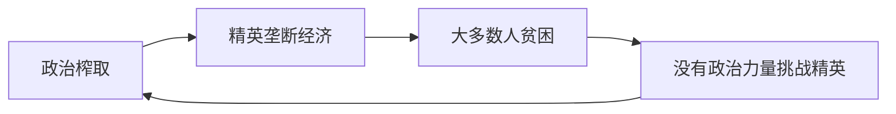

# 恶性循环

## 本章在全书中的位置

**机制分析章（第二部分）**。本章系统分析榨取式制度如何产生自我强化的恶性循环。

本章与前后章节的关系：
- 第11章（良性循环）→本章（恶性循环机制）→第13章（当代案例）

## 本章要回答的核心问题

**榨取式制度如何产生自我强化的恶性循环？为什么打破这种循环特别困难？**

## 本章的核心主张

### 核心命题一：恶性循环的三个支柱

**政治榨取→经济榨取→贫困加剧→政治榨取强化**

1. **政治榨取**：少数精英垄断政治权力
2. **经济榨取**：精英利用权力为自己谋取经济利益
3. **贫困加剧**：大多数人贫困，没有投资或创新激励

### 核心命题二：恶性循环的机制

**为什么是"自我强化"**：
- 精英垄断政治→保护榨取式经济→保持贫困
- 贫困→没有强大的中产阶级→精英更容易维持控制
- 精英联盟→更紧密→更难打破

### 核心命题三：为什么恶性循环比良性循环更难打破

**精英联盟的稳定性**：
- 从现状获益的人：富裕+有组织
- 受害的人：贫困+分散
- 信息不对称：精英控制媒体和宣传

**打破需要的条件**：
- 精英分裂
- 外部压力
- 广泛联盟的形成

## 论证链条拆解

### 步骤1：恶性循环的结构

### 步骤2：精英联盟的稳定性

**为什么精英联盟紧密**：
- 共同利益：维持榨取式制度
- 信息共享：控制媒体
- 激励机制：惩罚叛逃者

**为什么受害者难以组织**：
- 贫困：无法负担政治活动
- 分散：地理上和社会上分散
- 恐惧：报复的威胁

### 步骤3：打破恶性循环的条件

**需要的关键条件**：
1. **精英分裂**：精英内部出现裂痕
2. **外部压力**：外部威胁或危机
3. **广泛联盟**：穷人+中产阶级+部分精英联合

**塞拉利昂案例**：
- 独立后延续殖民制度
- 精英联盟强化榨取
- 最终爆发内战

## 关键概念与概念区分

### 概念：恶性循环（Vicious Circle）

- **定义**：榨取式制度如何产生自我强化的负向反馈
- **本章作用**：解释为什么有些国家持续贫困
- **机制**：政治榨取→经济榨取→贫困→政治榨取强化

### 概念：精英联盟（Elite Coalition）

- **定义**：从榨取式制度获益的少数精英形成的利益联盟
- **本章作用**：解释榨取式制度为何难以打破
- **关键**：联盟越紧密，制度越难改变

## 一分钟回看

**本章核心洞见**：榨取式制度产生自我强化的恶性循环：政治榨取→经济榨取→贫困→精英联盟强化→政治榨取强化。打破这种循环特别困难，因为精英联盟紧密，受害者分散贫困，难以组织反抗。打破需要精英分裂+外部压力+广泛联盟的形成。

**值得回看**：本章与第11章（良性循环）形成对照。理解恶性循环的机制，才能理解第14章（如何打破窠臼）的政策含义。
