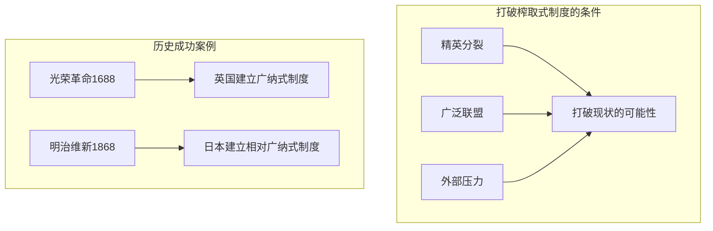

# 打破窠臼

## 本章在全书中的位置

**理论总结与政策含义章**。本章总结全书理论框架，讨论打破榨取式制度的条件。

本章与前后章节的关系：
- 第13章（当代失败案例）→本章（理论总结+打破条件）→第15章（收束）

## 本章要回答的核心问题

**如何打破榨取式制度的恶性循环？打破需要什么条件？**

## 本章的核心主张

### 核心命题一：打破榨取式制度的条件

**需要三个条件**：
1. **精英分裂**：精英内部出现裂痕
2. **广泛联盟**：穷人+中产阶级+部分精英联合
3. **外部压力**：外部威胁或危机

### 核心命题二：历史案例

**英国光荣革命**：
- 精英分裂（国会vs国王）
- 外部压力（荷兰入侵）
- 广泛联盟（商人+新贵族+地主）

**明治维新**：
- 外部压力（美国黑船事件）
- 精英分裂（下级武士+商人了vs幕府）
- 广泛联盟形成

### 核心命题三：为什么榨取式制度难以打破

**精英联盟的稳定性**：
- 越紧密，越难打破
- 精英控制军警和媒体
- 受害者分散贫困，难以组织

## 论证链条拆解

### 打破条件的分析

## 一分钟回看

**本章核心洞见**：打破榨取式制度需要三个条件：精英分裂、广泛联盟、外部压力。光荣革命和明治维新都是这三个条件同时满足的历史案例。打破榨取式制度困难，是因为精英联盟紧密，受害者分散。

**值得回看**：本章是理解全书政策含义的关键。
