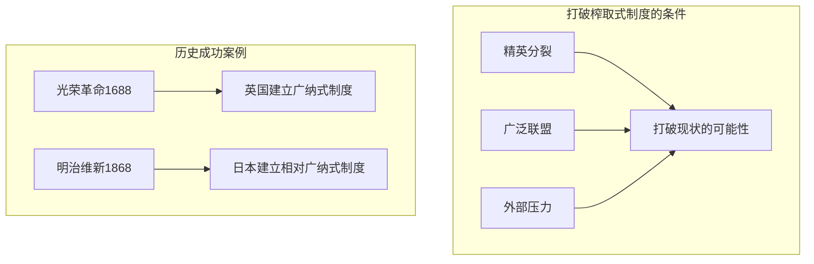

# 打破窠臼

## 本章在全书中的位置

**理论总结与政策含义章**。本章总结全书理论框架，讨论打破榨取式制度的条件。

本章与前后章节的关系：
- 第13章（当代失败案例）→本章（理论总结+打破条件）→第15章（收束）

## 本章要回答的核心问题

**如何打破榨取式制度的恶性循环？打破需要什么条件？**

## 本章的核心主张

### 核心命题一：打破榨取式制度的条件

**需要三个条件**：
1. **精英分裂**：精英内部出现裂痕
2. **广泛联盟**：穷人+中产阶级+部分精英联合
3. **外部压力**：外部威胁或危机

### 核心命题二：历史案例

**英国光荣革命**：
- 精英分裂（国会vs国王）
- 外部压力（荷兰入侵）
- 广泛联盟（商人+新贵族+地主）

**明治维新**：
- 外部压力（美国黑船事件）
- 精英分裂（下级武士+商人了vs幕府）
- 广泛联盟形成

### 核心命题三：为什么榨取式制度难以打破

**精英联盟的稳定性**：
- 越紧密，越难打破
- 精英控制军警和媒体
- 受害者分散贫困，难以组织

## 论证链条拆解

### 打破条件的分析

## 容易被忽略的细节

### 细节1：三个非洲酋长（Three African Chiefs）

**这个案例的背景**：
- 欧洲殖民者瓜分非洲（1884-1885年柏林会议）之前，非洲有自己的政治组织
- 许多非洲社会有相对复杂政治结构——王国、苏丹国、部落联盟

**案例一：埃塞俄比亚的孟尼利克二世（Menelik II）**：
- 1889-1913年统治埃塞俄比亚
- 1896年：在阿杜瓦（Adwa）战役中击败意大利殖民者
- 这是非洲军队第一次在正面战场上击败欧洲军队
- 孟尼利克通过这种军事胜利维护了埃塞俄比亚的独立

**案例二：恩津加·库夸内（Njinga Mbandi）**：
- 17世纪的安哥拉和纳米比亚地区的女王
- 她建立了一个强大的王国，与葡萄牙殖民者斗争
- 她通过灵活的外交和军事策略，维持了数十年的独立

**案例三：非洲其他地区的殖民化**：
- 大多数非洲政治领袖无法抵抗欧洲殖民者
- 原因：武器差距、政治分裂、内部冲突
- 柏林会议（1884-1885）加速了非洲的殖民化

**为什么这三个案例很重要**：
- 它们说明了非洲在殖民化之前的政治多样性
- 它们说明了抵抗殖民的可能性（虽然大多数失败了）
- 它们为理解非洲当前的榨取式制度提供了历史背景

### 细节2：南方榨取式制度的末日

**美国南方的种族隔离制度（Jim Crow）如何终结**：
- 1950-1960年代：民权运动兴起
- 1955年：蒙哥马利公交车抵制运动（Rosa Parks）
- 1960年：学生静坐运动
- 1963年：华盛顿大游行（"我有一个梦想"演讲）
- 1964年：《民权法案》（Civil Rights Act）
- 1965年：《投票权法案》（Voting Rights Act）

**为什么民权运动成功了**：
1. **精英分裂**：北方商人和南方商人对种族隔离的成本有不同看法
2. **广泛联盟**：黑人教会、学生组织、白人自由主义者、北方政客组成联盟
3. **外部压力**：媒体的关注和国际形象压力（冷战期间）

**关键洞见**：南方种族隔离的终结说明了第14章的核心论点——打破榨取式制度需要三个条件同时满足。

### 细节3：中国的重生

**中国1978年改革的背景**：
- 1949年：共产党革命，建立了榨取式计划经济制度
- 1958-1962年：大跃进失败，约1500-5500万人死亡
- 1966-1976年：文化大革命，经济崩溃
- 1976年：毛泽东去世，四人帮被捕
- 1978年：邓小平开始改革开放

**改革的机制**：
1. **农村改革（1978-1984）**：
   - 家庭联产承包责任制（ Household Responsibility System）
   - 农民可以保留超出配额的产出
   - 这创造了激励——农民开始更努力工作

2. **对外开放（1978年后）**：
   - 建立经济特区（深圳、珠海、汕头、厦门）
   - 吸引外国直接投资
   - 出口导向型制造业

3. **但政治制度没有根本变化**：
   - 共产党继续垄断政治权力
   - 审查制度压制政治异议
   - 腐败和官僚主义仍然是严重问题

**为什么这可能是"榨取式成长"**：
- 经济增长主要来自技术追赶和出口导向制造业
- 创新激励仍然受限——产权保护不完善
- 政治权力集中导致政策的不确定性
- 作者认为，这种成长模式不可持续，最终需要政治改革

### 细节4：打破榨取式制度的历史案例

**英国光荣革命（1688）的完整过程**：

1. **背景**：
   - 詹姆斯二世（James II）试图恢复天主教和绝对王权
   - 1687年：发布《信仰自由宣言》（Declaration of Indulgence）
   - 1688年：任命天主教徒为军官

2. **精英分裂**：
   - 托利党和辉格党贵族联合起来反对詹姆斯二世
   - 他们邀请荷兰奥兰治亲王威廉（William of Orange）入侵

3. **外部压力**：
   - 威廉带着军队（约15,000人）登陆英格兰
   - 詹姆斯二世的军队叛变
   - 詹姆斯逃亡法国

4. **广泛联盟**：
   - 威廉的入侵得到了英格兰贵族、地主、商人的支持
   - 国会宣布威廉和玛丽为共同君主
   - 1689年《权利法案》确立了议会至上

**日本明治维新（1868）的完整过程**：

1. **背景**：
   - 德川幕府（1603-1868）统治日本200多年
   - 1853年：美国黑船事件，强迫日本开放贸易
   - 外国压力打破了幕府的合法性

2. **精英分裂**：
   - 下级武士（特别是长州和萨摩藩）开始反对幕府
   - 商人（特别是大阪和东京的商人）开始支持倒幕运动
   - 幕府内部的改革派也开始转向倒幕

3. **外部压力**：
   - 外国的军事威胁（1853-1868）
   - 签订不平等条约（1858年《安政条约》）
   - 民族主义情绪上升

4. **广泛联盟**：
   - 1868年倒幕联盟包括了武士、商人、地主和部分贵族
   - 鸟羽-伏见之战（1868年1月），幕府军队战败
   - 明治政府建立

## 论证强度评估

**最强处**：
- 三个条件的分析框架清晰且有历史依据
- 光荣革命和明治维新的案例具有高度可比性
- 与全书框架完美衔接

**最弱处**：
- 这两个案例是否具有普遍性？
- 很多试图打破榨取式制度的尝试都失败了（如法国大革命、俄国革命）

## 前提、限制与例外

### 作者隐含的前提

1. **精英分裂是可能的**：假设精英联盟不是完全稳定的
2. **外部压力可以打破平衡**：假设外部危机可以创造变革机会
3. **广泛联盟可以形成**：假设不同阶层可以联合起来

### 适用范围

- 本章论证主要适用于**历史上有过成功打破榨取式制度经验的社会**
- 对从未出现过这种机会的社会适用性不确定

### 作者承认的限制

- **条件很难同时满足**：大多数情况下，三个条件不会同时出现
- **即使满足也可能失败**：法国大革命就是一个例子

## 图像、图表与表格信息

EPUB提取未获取可靠图注，推测内容包括：
- **光荣革命1688年入侵路线图**
- **明治维新各藩立场图**
- **打破榨取式制度的条件分析图**

**建议**：回看原书核对第14章的地图和时间线

## 一分钟回看

**本章核心洞见**：打破榨取式制度需要三个条件：精英分裂、广泛联盟、外部压力。光荣革命和明治维新都是这三个条件同时满足的历史案例。打破榨取式制度困难，是因为精英联盟紧密，受害者分散。

**值得回看**：本章是理解全书政策含义的关键。
